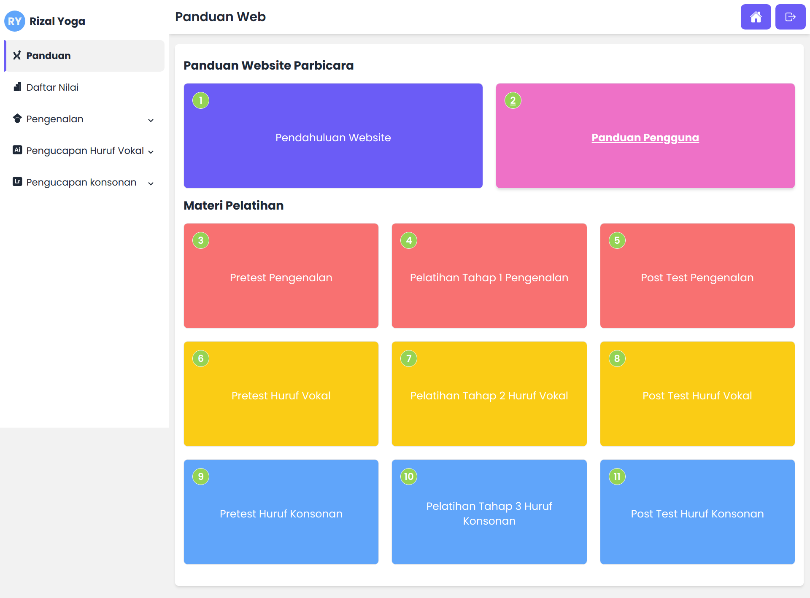

<!-- PROJECT LOGO -->

# Parbicara

Parbicara adalah platform pembelajaran yang dirancang khusus untuk membantu orang tua dalam mendidik anak tunarungu secara mandiri. Parbicara menyediakan materi dan video yang komprehensif untuk memfasilitasi intervensi efektif dalam pengembangan kemampuan berbicara seorang anak.

## 🔗 Demo

Parbicara website dapat diakses pada link berikut: <a href="https://prabicara.vercel.app/" target="_blank">Parbicara</a>

Video demo parbicara: <a href="https://www.youtube.com/watch?v=PyLOK8VGkcc" target="_blank">Video Demo</a>

## 🔮 Fitur

- Registrasi akun
- Autentikasi akun pengguna
- Materi pembelajaran berupa text dan video
- Kuis pilihan ganda
- Daftar nilai pengguna

## ⛏️ Dibangun menggunakan

- [Node JS v20.4.0](https://nodejs.org/id)
- [NPM](https://www.npmjs.com/)
- [Next-JS 14](https://nextjs.org/)
- [Tailwind-CSS](https://tailwindcss.com/)
- [Daisy-IU](https://daisyui.com/)

## 👤 Autor

- [Rizalyoga](https://github.com/rizalyoga/)

## 🖼️ Tampilan

### Halaman depan

### Halaman dashboard

